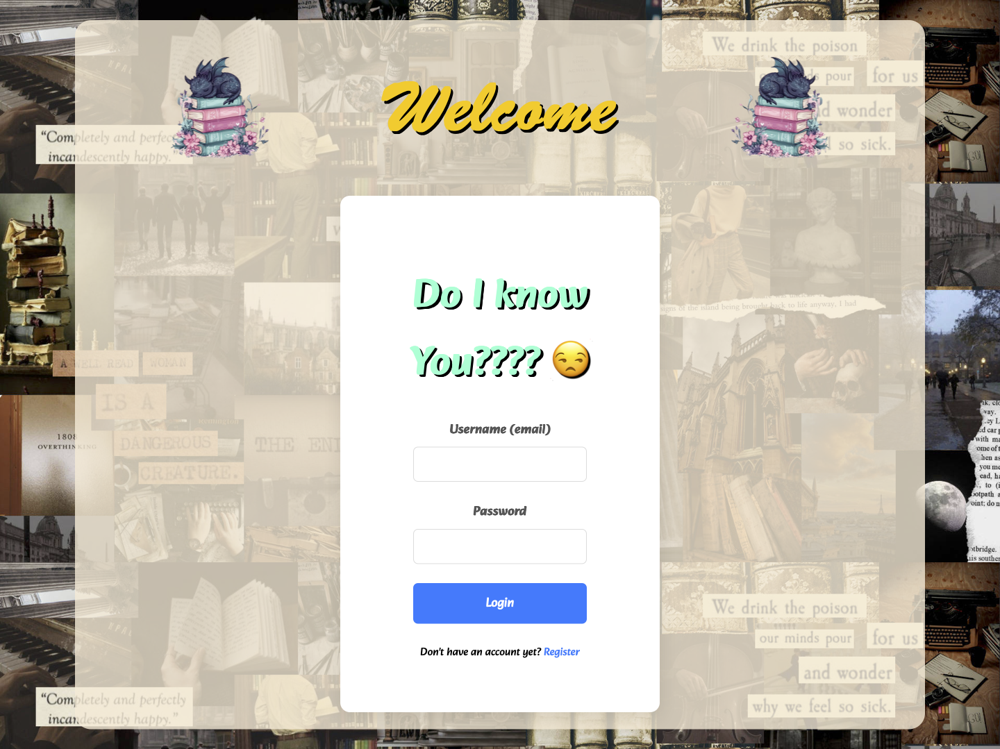
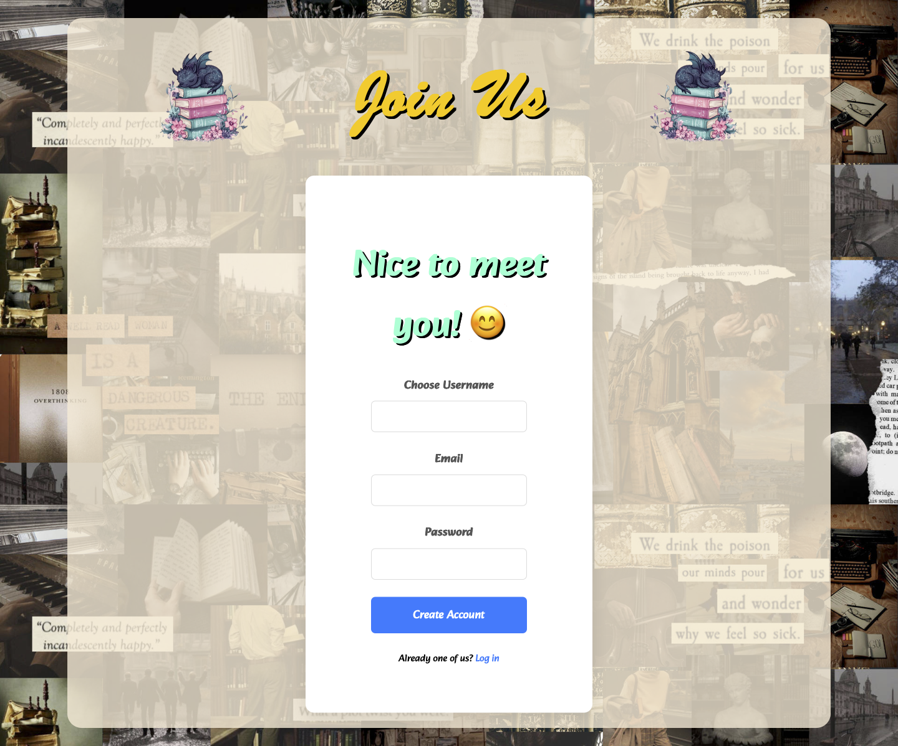
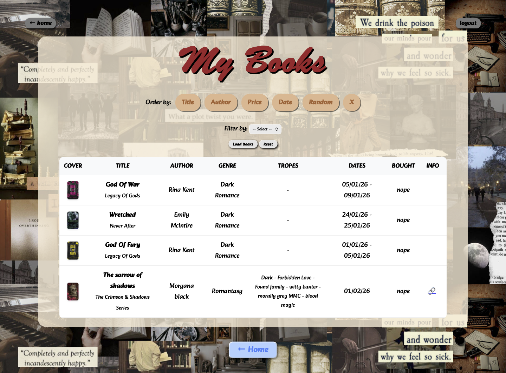
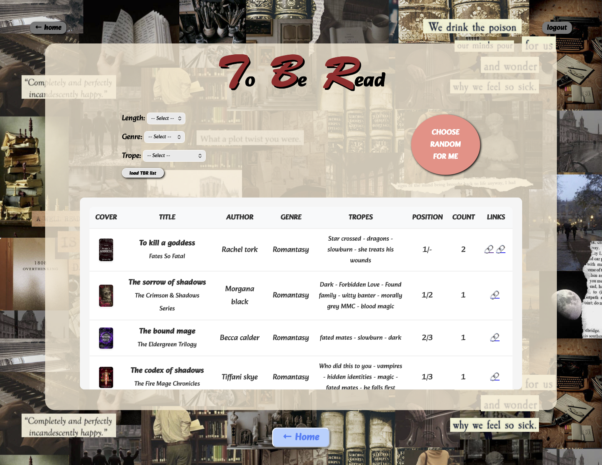
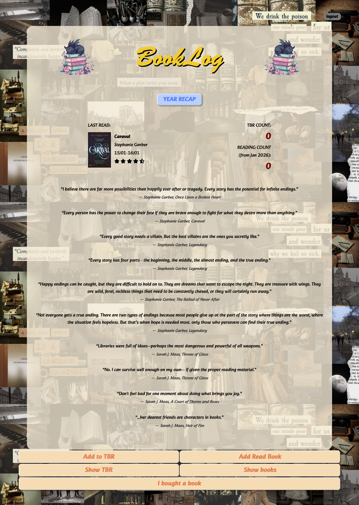
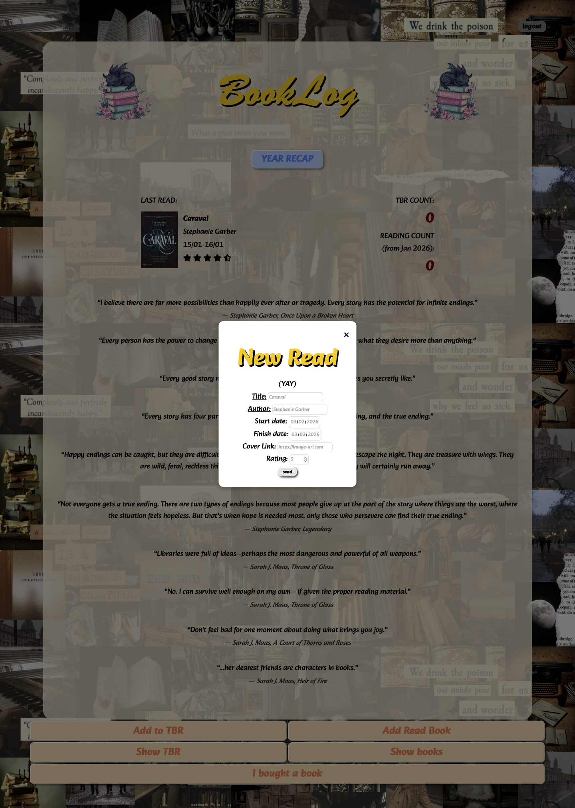
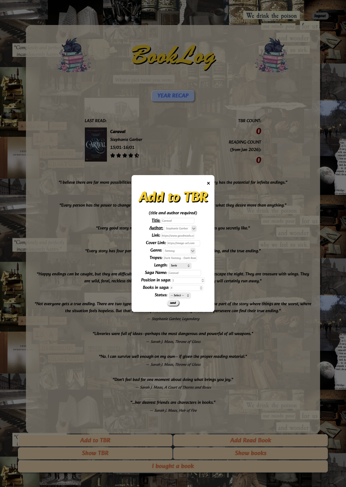

BookLog is my personal manual solution to turn chaotic saved videos and scattered links into an organized digital library.  [(Screenshots)](#gallery)

## The Problem
I'm very very lazy and so i add thousands of reels on instagram folders names 'read later' or 'tbr' or 'want to read' and then completely forget about them. **BookLog** is my easy manual solution to finally give those links a home, transforming saved videos into an organized TBR list and have someone chosing the next book for me.

## Features
* **TBR Management:** A dedicated space to paste those bookish links that would otherwise get lost in the "saved" folders.
* **Podium View:** A special showcase for the "Top 3" books of the year with a custom-built podium.
* **Year review** A sum up of the reading year, showing also a favourite book for each month.

## Tech Stack
* **HTML5 / CSS3:** The entire UI is handcrafted without external UI frameworks. It features a fully responsive layout and custom-themed components.
* **Development Environment:** Powered by Node.js and Vite. This setup enables fast Hot Module Replacement, secure environment variable handling, and an optimized build process.
* **Backend & Auth:** Integrated with Supabase (PostgreSQL) for real-time database management and secure user authentication.
* **FontAwesome:** For social media icons and the rating system.
* **Google Fonts:** Using editorial fonts.

## DB config
> **Note:** To set up the database, use the following SQL script as a base.   
> -- WARNING: This schema is for context only and is not meant to be run.  
> -- Table order and constraints may not be valid for execution.
```sql
CREATE TABLE public.Books (  
  title character varying NOT NULL,  
  author character varying NOT NULL,  
  length character varying,  
  saga character varying,  
  serie_position smallint,  
  status boolean,  
  cover_link character varying,  
  ID uuid NOT NULL DEFAULT gen_random_uuid(),  
  genre character varying,  
  tropes text,  
  saga_total_books smallint,  
  user_id uuid DEFAULT auth.uid(),  
  CONSTRAINT Books_pkey PRIMARY KEY (ID),  
  CONSTRAINT Books_user_id_fkey FOREIGN KEY (user_id) REFERENCES auth.users(id)  
);    

CREATE TABLE public.Monthly_Favourites (
  id uuid NOT NULL DEFAULT gen_random_uuid(),
  user_id uuid NOT NULL DEFAULT auth.uid(),
  book_id uuid DEFAULT gen_random_uuid(),
  month integer NOT NULL,
  year bigint NOT NULL,
  CONSTRAINT Monthly_Favourites_pkey PRIMARY KEY (id),
  CONSTRAINT Monthly_Favourites_book_id_fkey FOREIGN KEY (book_id) REFERENCES public.Books(ID),
  CONSTRAINT Monthly_Favourites_user_id_fkey FOREIGN KEY (user_id) REFERENCES auth.users(id)
);  

CREATE TABLE public.Profiles (
  id uuid NOT NULL DEFAULT gen_random_uuid(),
  username text NOT NULL UNIQUE,
  email text NOT NULL UNIQUE,
  created_at timestamp with time zone DEFAULT now(),
  CONSTRAINT Profiles_pkey PRIMARY KEY (id),
  CONSTRAINT Profiles_id_fkey FOREIGN KEY (id) REFERENCES auth.users(id)
);  

CREATE TABLE public.Purchase (
  id uuid NOT NULL DEFAULT gen_random_uuid(),
  user_id uuid NOT NULL DEFAULT auth.uid(),
  book_id uuid DEFAULT gen_random_uuid(),
  price real,
  shop_date date,
  CONSTRAINT Purchase_pkey PRIMARY KEY (id),
  CONSTRAINT Purchase_book_id_fkey FOREIGN KEY (book_id) REFERENCES public.Books(ID),
  CONSTRAINT Purchase_user_id_fkey FOREIGN KEY (user_id) REFERENCES auth.users(id)
);  

CREATE TABLE public.Read (
  id uuid NOT NULL DEFAULT gen_random_uuid(),
  user_id uuid NOT NULL DEFAULT auth.uid(),
  book_id uuid DEFAULT gen_random_uuid(),
  start_date date,
  finish_date date NOT NULL,
  stars real CHECK (stars >= 0::double precision AND stars <= 5::double precision),
  is_from_tbr boolean DEFAULT false,
  CONSTRAINT Read_pkey PRIMARY KEY (id),
  CONSTRAINT Read_book_id_fkey FOREIGN KEY (book_id) REFERENCES public.Books(ID),
  CONSTRAINT Read_bser_id_fkey FOREIGN KEY (user_id) REFERENCES auth.users(id)
);  

CREATE TABLE public.TBR (
  link character varying,
  add_date date,
  ID uuid NOT NULL DEFAULT gen_random_uuid(),
  user_id uuid NOT NULL DEFAULT auth.uid(),
  book_id uuid NOT NULL DEFAULT gen_random_uuid(),
  CONSTRAINT TBR_pkey PRIMARY KEY (ID),
  CONSTRAINT TBR_book_id_fkey FOREIGN KEY (book_id) REFERENCES public.Books(ID),
  CONSTRAINT TBR_user_id_fkey FOREIGN KEY (user_id) REFERENCES auth.users(id)
);  

CREATE TABLE public.Top_3_Year (
  id uuid NOT NULL DEFAULT gen_random_uuid(),
  user_id uuid NOT NULL DEFAULT auth.uid(),
  book_id uuid NOT NULL DEFAULT gen_random_uuid() UNIQUE,
  rank integer,
  year integer,
  CONSTRAINT Top_3_Year_pkey PRIMARY KEY (id),
  CONSTRAINT Top_3_Year_book_id_fkey FOREIGN KEY (book_id) REFERENCES public.Books(ID),
  CONSTRAINT Top_3_Year_user_id_fkey FOREIGN KEY (user_id) REFERENCES auth.users(id)
);  
```
## How to install & run
1. **Clone** the repo:  
   `git clone https://github.com/Roxfili/booklog.git`
2. **Install dependencies**:  
   Navigate to the folder and run: `npm install`
3. **Set up your environment**:  
   Create a `.env` file in the root folder and add your Supabase credentials:
   ```text
   VITE_SUPABASE_URL=your_supabase_url_here
   VITE_SUPABASE_KEY=your_supabase_anon_key_here
4. **Run the app**:  
    Start the development server: npx vite  
    Open the link provided in the terminal (usually http://localhost:5173)

## Future Features
I'm constantly working to make BookLog more intuitive. Planned updates include:
* **Advanced Statistics:** Visual charts to see your most read genres and monthly reading pace.
* **Automatic Cover Fetching:** Integration with OpenLibrary API to automatically find book covers by title or ISBN.
* **Reading Challenges:** A progress tracker for your yearly reading goals.
* **Full Reviews:** I'm lazy and never write reviews.I'm successfully procrastinating this feature for as long as possible, but it might eventually show up.

## Credits & Goals
This project was born from a personal need to organize my "BookTok" chaos. It's a work-in-progress journey into modern web development, focusing on clean UI and efficient database management.
If it sucks, i'm sorry, i'm tired.

## Gallery
> Note: The data shown in the screenshots are placeholders used for UI testing purposes.
<div style="align:center">
  
  
  
  
</div>
<div style="align:center">
  
  
  
  
</div>


---
**Made with insomnia by me <3**

